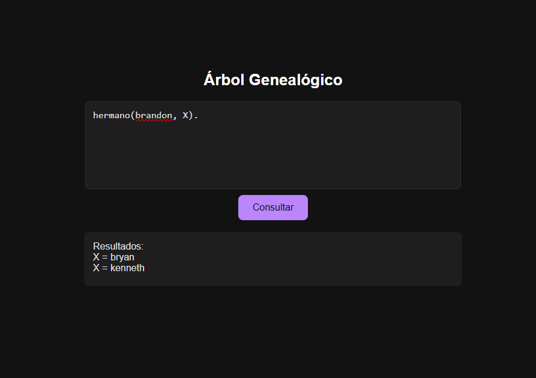
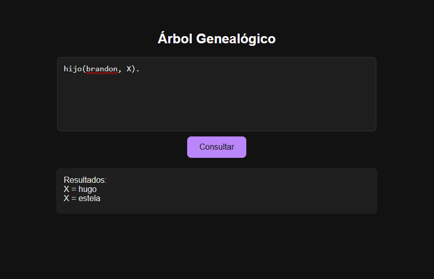
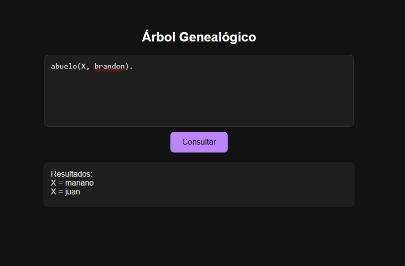

# Hoja de Trabajo 1

* Reglas implementadas

```prolog
hermano(X, Y) :- padre(P, X), padre(P, Y), madre(M, X), madre(M, Y), X \\= Y.
hijo(X, P) :- padre(P, X); madre(P, X).
abuelo(X, Y) :- padre(X, P), (padre(P, Y); madre(P, Y)).
abuela(X, Y) :- madre(X, P), (padre(P, Y); madre(P, Y)).
```

* Consultas



